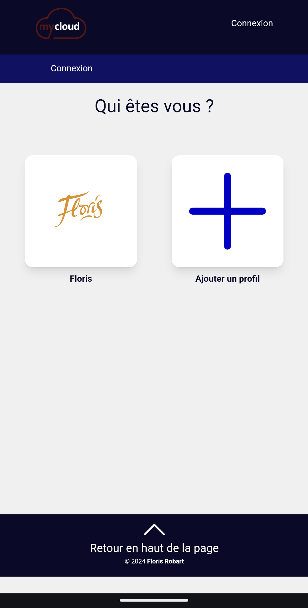
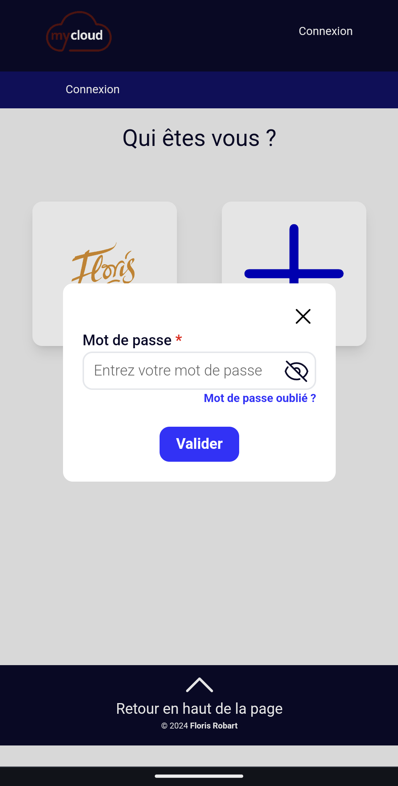
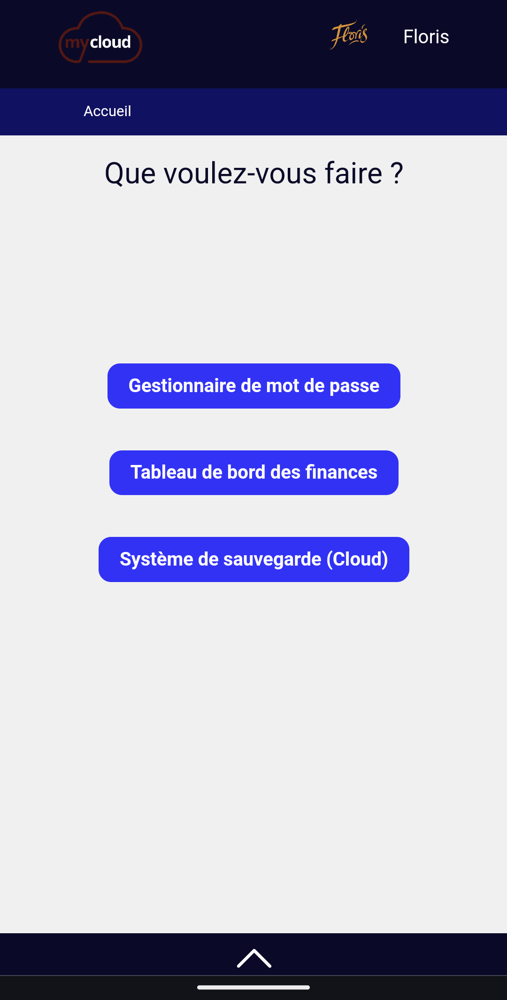
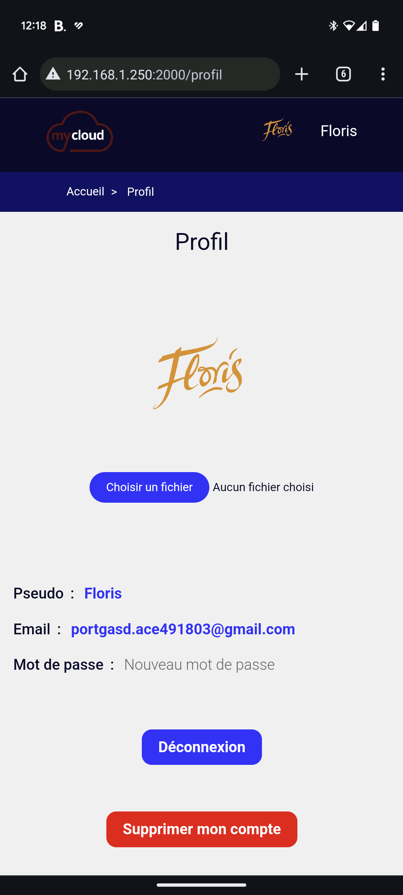
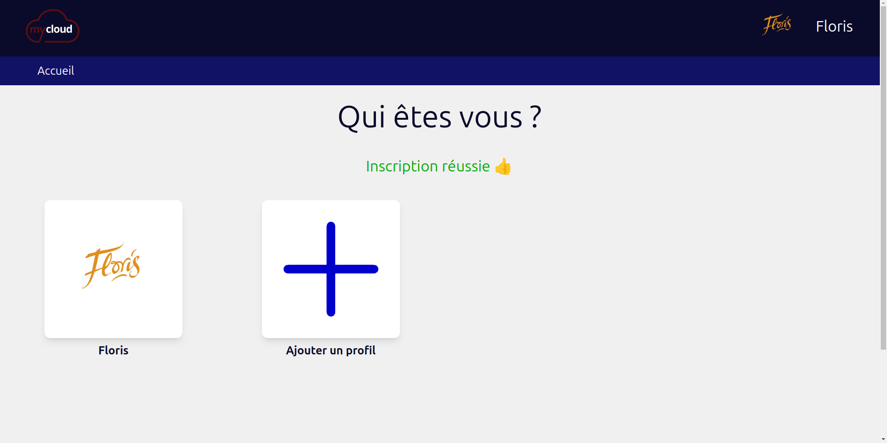
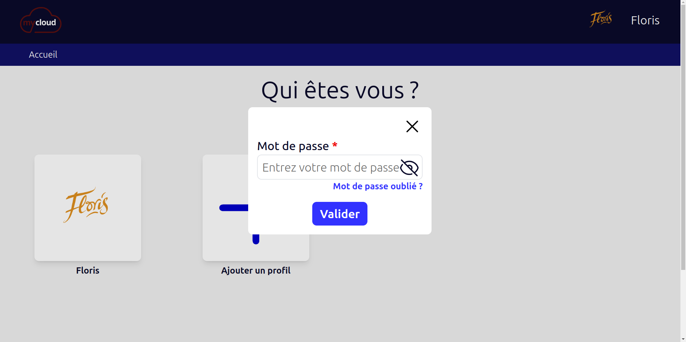
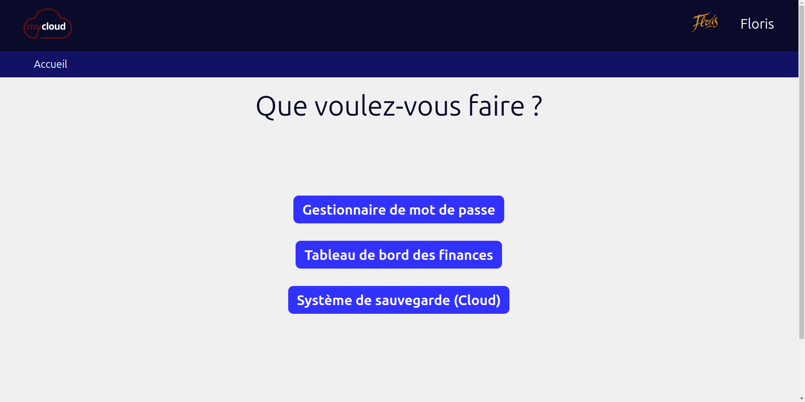
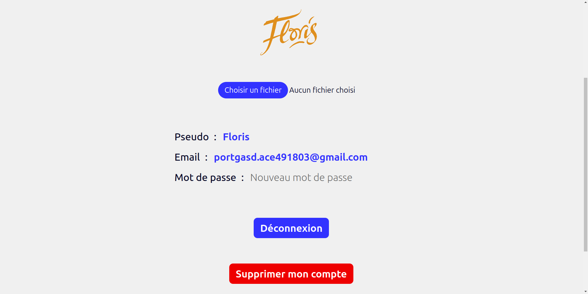

# Gestionnaire de compte

## Table des matières

- [Gestionnaire de compte](#gestionnaire-de-compte)
  - [Table des matières](#table-des-matières)
  - [Présentation](#présentation)
  - [Fonctionnalités](#fonctionnalités)
  - [Images](#images)
    - [Format mobile](#format-mobile)
    - [Format ordinateur](#format-ordinateur)
      - [Page du Account manager en format desktop](#page-du-account-manager-en-format-desktop)
  - [Technologies utilisées](#technologies-utilisées)
  - [Installation](#installation)
    - [Prérequis](#prérequis)
    - [Installation de Account manager](#installation-de-account-manager)
    - [Lancer Account manager](#lancer-account-manager)
  - [Autheur](#autheur)
  - [Report de bug et suggestions](#report-de-bug-et-suggestions)
  - [License](#license)

## Présentation

**Account manager** est une application web de gestion de compte. Elle permet d'enregistrer et de gérer ces comptes et mot de passe. Vous pouvez ajouter, modifier, supprimer, rechercher, trier et filtrer vos compte pour pouvoir copié votre mot de passe le plus rapidement possible. Il est totalement sécurisé grâce à un système de cryptage basé sur une clé qui n'est pas enregistrer dans la base de données, se qui fait que même si la base de données est piratée, les mots de passe ne pourront pas être déchiffrés.

*Account manager** à été conçue pour être utilisé par plusieurs personnes, c'est pourquoi elle permet de créer plusieurs comptes utilisateurs. Chaque utilisateur peut voir uniquement ses propres comptes, il ne peut pas voir les comptes des autres utilisateurs. Si un utilisateur arrive quand même à accéder aux comptes d'un autre utilisateur (se qui n'est normalement pas possible), il ne pourra pas voir les mots de passe, car ils sont cryptés avec une clé qui est propre à chaque utilisateur et qui n'est pas enregistrée dans la base de données. Si vous êtes seul à utiliser l'application et que vous ne voulez pas créer de compte utilisateur, vous devrez modifier le code source (ce qui est tout à fait possible).

**Account manager** n'est pas disponible en ligne, si vous voulez l'utiliser, vous devrez l'installer sur votre propre serveur. Si vous voulez créer un serveur personnel vous pouvez suivre les instructions de ma documentation sur la [création d'un serveur personnel](https://florobart.github.io/Documentations/src/doc_creation_serveur_local.html). Si vous avez déjà un serveur personnel, vous pouvez suivre les [instructions d'installation de **Account manager**](#installation).

## Fonctionnalités

**Grâce à cette application vous pourrez :**

- **Ajouter un compte :**
  - Vous pouvez ajouter un compte en renseignant son **nom**, son **identifiant**, son **mot de passe** et votre **pseudo**.
- **Modifier un compte :**
  - Vous pouvez modifier un compte en renseignant son **nom**, son **identifiant**, son **mot de passe** et votre **pseudo**.
- **Supprimer un compte :**
  - Vous pouvez supprimer un compte en cliquant sur le bouton **Supprimer**.
- **Rechercher un compte :**
  - Vous pouvez rechercher un compte grâce à la barre de recherche qui recherche dans le **nom**, l'**identifiant** et le **pseudo**.
- **Trier les comptes :**
  - Vous pouvez trier les comptes par **nom**, **identifiant**, **pseudo** et **date de création**.
- **Filtrer les comptes :**
  - Vous pouvez filtrer les comptes par **nom**, **identifiant** et **pseudo**.
- **Copier un mot de passe :**
  - Vous pouvez copier un mot de passe en cliquant dessus.
- **Sauvegarder vos comptes dans un fichier Markdown :**
- Vous accès à quelque statistique sur vos comptes :
  - Le nombre de comptes
  - Le nombre de comptes différents
  - Le nombre d'idendifiants différents
  - Le nombre de comptes Gmail différents
  - Le nombre de pseudo différents

**Account manager** est une application web open-source, elle est donc gratuite et libre d'utilisation. Vous pouvez l'utiliser, la modifier, la distribuer, la partager, etc. comme bon vous semble. Par contre, vous ne pouvez pas la vendre, ni la commercialiser, ni la distribuer sans en donner l'accès gratuit.

## Images

### Format mobile

<div style="display: flex; justify-content: space-between;">
  
  
</div>

<div style="display: flex; justify-content: space-between;">
  
  
</div>

### Format ordinateur

<div style="display: flex; justify-content: space-between;">
  
  
</div>

<div class="page">

<div style="display: flex; justify-content: space-between;">
  
  
</div>

#### Page du Account manager en format desktop

## Technologies utilisées

**Account manager** est une application web développée avec les technologies suivantes :

- **Langages :**
  - PHP
  - MySQL
  - JavaScript
  - *HTML*
  - *CSS*
- **Frameworks et librairies :**
  - Laravel
  - Tailwind CSS

## Installation

### Prérequis

Pour installer **Account manager** sur votre serveur, vous devez avoir les prérequis suivants :

- [Un serveur sous Linux de préférence](https://florobart.github.io/Documentations/src/doc_creation_serveur_local.html)
  - Vous pouvez également l'installer sur un ordinateur de bureau ou un hébergement web sous Linux, Windows ou MacOS, mais vous devrez adapter vous-même les instructions d'installation.
- [PHP 8.x](https://florobart.github.io/Documentations/src/doc_developpement_web.html#php) (avec les extensions suivantes)
- [Composer](https://florobart.github.io/Documentations/src/doc_developpement_web.html#composer)
- [Node.js](https://florobart.github.io/Documentations/src/doc_developpement_web.html#installation-de-nodejs---linux)
- [NPM](https://florobart.github.io/Documentations/src/doc_developpement_web.html#installation-de-npm---linux)
- [XAMPP](https://florobart.github.io/Documentations/src/doc_developpement_web.html#xampp)
  - Vous pouvez également utiliser un autre serveur web, mais vous devrez adapter vous-même les instructions d'installation.
  - Vous pouvez aussi [installer Apache](https://florobart.github.io/Documentations/src/doc_developpement_web.html#apache) et [MySQL](https://florobart.github.io/Documentations/src/doc_developpement_web.html#mysql) séparément, mais XAMPP vous facilitera grandement l'installation et la configuration de ces deux logiciels.

### Installation de Account manager

- [Installer Home Server Maison](https://github.com/FloRobart/Home_server_maison?tab=readme-ov-file#installation)
- [Lancer Home Server Maison](https://github.com/FloRobart/Home_server_maison?tab=readme-ov-file#lancement-home-server-maison)
- [Installer Account manager](https://github.com/FloRobart/Account_manager/archive/refs/tags/v1.0.0.zip)
- Copier le fichier `.env.example` dans le fichier `.env`
  - Vous pouvez modifier le nom de la base de données, le nom d'utilisateur et le mot de passe dans le fichier `.env` pour s'adapter à votre configuration. Si vous avez laissé les valeurs par défaut lors de l'installation de XAMPP, vous n'avez pas besoin de modifier le fichier `.env`.
- Créer les base de données

  ```bash
  php artisan migrate --database=account_manager
  ```

- Modifier le fichier `routes/web.php` pour remplacer <IP Home Server Maison> pour l'adresse IP et le port de votre serveur Home Server Maison
  - Par exemple, si votre serveur Home Server Maison est accessible à l'adresse `192.168.1.30:3000`, vous devez remplacer `<IP Home Server Maison>` par `http://192.168.1.30:3000` dans le fichier `routes/web.php`.
- Compiler les assets

  ```bash
  npm install
  npm run build
  ```

### Lancer Account manager

- Lancer le serveur

  ```bash
  php artisan serve --host=0.0.0.0 --port=2000
  ```

- Vous pouvez maintenant accéder à l'application à l'adresse `http://<IP Serveur>:2000` (remplacer `<IP Serveur>` par l'adresse IP de votre serveur sur lequel vous avez installé **Account manager**).
  - Notez qu'en suivant ces instructions, vous aurez accès à **Account manager** uniquement si vous êtes connecté au même réseau que votre serveur. Si vous voulez accéder à **Account manager** depuis un autre réseau, vous devrez configurer votre serveur pour qu'il soit accessible depuis l'extérieur. Mais **ATTENTION** je ne recommande pas de le faire si vous n'avez pas les compétences, car cela peut poser des problèmes de sécurité.

## Autheur

Account manager est un projet open-source développé seulement par [Floris Robart](https://florobart.github.io/)

## Report de bug et suggestions

Si vous découvrez une erreur, quelquelle soit, cela peut êgre une faute de frappe ou d'orthographe, une erreur de calcul, une erreur de conception, un bug qui empêche le bon fonctionnement de l'application, ou tout autre problème, Merci de me le signaler par mail à l'adresse [florobart.github@gmail.com](mailto:florobart.github@gmail.com). Toutes les erreurs, quelque soit leur nature ou leur importance, seront traitées le plus rapidement possible.

Si vous avez une une **suggestion**, une **idée**, une **amélioration**, ou une **demande de fonctionnalité**, merci de me la communiquer par mail à l'adresse [florobart.github@gmail.com](mailto:florobart.github@gmail.com). Toutes les suggestions, quelque soit leur nature ou leur importance, seront étudiées et prises en compte dans la mesure du possible.

## License

Account manager est un projet open-source sous licence [GNU General Public License v3.0](https://opensource.org/licenses/GPL-3.0).
