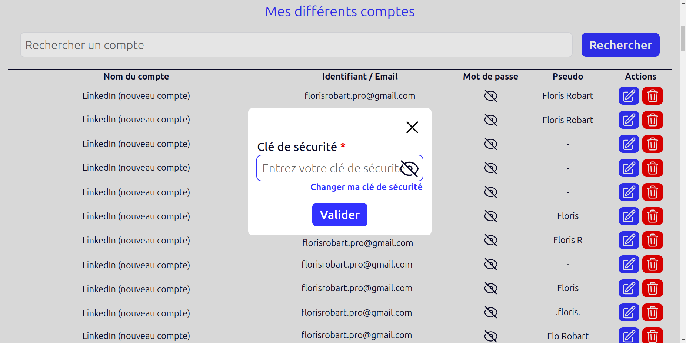

# Gestionnaire de compte

## Table des matières

- [Gestionnaire de compte](#gestionnaire-de-compte)
  - [Table des matières](#table-des-matières)
  - [Présentation](#présentation)
  - [Fonctionnalités](#fonctionnalités)
  - [Images](#images)
    - [Format mobile](#format-mobile)
    - [Format ordinateur](#format-ordinateur)
  - [Technologies utilisées](#technologies-utilisées)
  - [Installation](#installation)
    - [Prérequis](#prérequis)
    - [Installation de Lys secure](#installation-de-lys-secure)
  - [Autheur](#autheur)
  - [Report de bug et suggestions](#report-de-bug-et-suggestions)
  - [License](#license)

## Présentation

**Lys secure** est une application web de gestion de compte. Elle permet d'enregistrer et de gérer ces comptes et mots de passe. Vous pouvez ajouter, modifier, supprimer, rechercher, trier et filtrer vos comptes pour pouvoir copié votre mot de passe le plus rapidement possible. Il est totalement sécurisé grâce à un système de cryptage basé sur une clé qui n'est pas enregistré dans la base de données, ce qui fait que même si la base de données est piratée, les mots de passe ne pourront pas être déchiffrés.

**Lys secure** a été conçue pour être utilisé par plusieurs personnes, c'est pourquoi elle permet de créer plusieurs comptes utilisateurs. Chaque utilisateur peut voir uniquement ses propres comptes, il ne peut pas voir les comptes des autres utilisateurs. Si un utilisateur arrive quand même à accéder aux comptes d'un autre utilisateur (ce qui n'est normalement pas possible), il ne pourra pas voir les mots de passe, car ils sont cryptés avec une clé qui est propre à chaque utilisateur et qui n'est pas enregistrée dans la base de données. Si vous êtes seul à utiliser l'application et que vous ne voulez pas créer de compte utilisateur, vous devrez modifier le code source (ce qui est tout à fait possible).

**Lys secure** n'est pas disponible en ligne, si vous voulez l'utiliser, vous devrez l'installer sur votre propre serveur. Si vous voulez créer un serveur personnel, vous pouvez suivre les instructions de ma documentation sur la [création d'un serveur personnel](https://florobart.github.io/Documentations/src/doc_creation_serveur_local.html). Si vous avez déjà un serveur personnel, vous pouvez suivre les [instructions d'installation de **Lys secure**](#installation).

**Lys secure** est une application web open source, elle est donc gratuite et libre d'utilisation. Vous pouvez l'utiliser, la modifier, la distribuer et la partager gratuitement. Par contre, vous ne pouvez ni la vendre, ni la commercialiser, ni la distribuer sans en donner l'accès gratuit, conformément à ce qui est noté dans [la licence](#license).

## Fonctionnalités

**Grâce à cette application, vous pourrez :**

- **Ajouter un compte :** Vous pouvez ajouter un compte en renseignant son **nom**, son **identifiant**, son **mot de passe** et votre **pseudo**.
- **Modifier un compte :** Vous pouvez modifier un compte en renseignant son **nom**, son **identifiant**, son **mot de passe** et votre **pseudo**.
- **Supprimer un compte :** Vous pouvez supprimer un compte en cliquant sur le bouton **Supprimer**.
- **Rechercher un compte :** Vous pouvez rechercher un compte grâce à la barre de recherche qui recherche dans le **nom**, l'**identifiant** et le **pseudo**.
- **Trier les comptes :** Vous pouvez trier les comptes par **nom**, **identifiant**, **pseudo** et **date de création**.
- **Filtrer les comptes :** Vous pouvez filtrer les comptes par **nom**, **identifiant** et **pseudo**.
- **Copier un mot de passe :** Vous pouvez copier un mot de passe en cliquant dessus.
- **Sauvegarder vos comptes dans un fichier Markdown :** Vous pouvez sauvegarder vos comptes dans un fichier Markdown en cliquant sur le bouton **Exporter**.
- **Importer des comptes depuis un fichier Markdown :** Vous pouvez importer des comptes depuis un fichier Markdown en cliquant sur le bouton **Importer**.
- **Voir des statistiques sur vos comptes :** Vous pouvez voir des statistiques sur vos comptes.
  - Le nombre de comptes
  - Le nombre de comptes différents
  - Le nombre d'identifiants différents
  - Le nombre de comptes Gmail différents
  - Le nombre de pseudos différents

## Images

### Format mobile

<div style="display: flex; justify-content: space-between;">
  
  
</div>

<div style="display: flex; justify-content: space-between; margin-top: 10px;">
  
  
</div>

### Format ordinateur

<div style="display: flex; justify-content: space-between;">
  
  
</div>

<div style="display: flex; justify-content: space-between; margin-top: 10px;">
  
  
</div>

## Technologies utilisées

**Lys secure** est une application web développée avec les technologies suivantes :

- **Langages :**
  - PHP
  - MySQL
  - JavaScript
  - *HTML*
  - *CSS*
- **Frameworks et librairies :**
  - Laravel
  - Tailwind CSS

## Installation

### Prérequis

Pour installer **Lys secure** sur votre serveur, vous devez avoir les prérequis suivants :

- [Un serveur sous Linux de préférence](https://florobart.github.io/Documentations/src/doc_creation_serveur_local.html)
  - Vous pouvez également l'installer sur un ordinateur de bureau ou un hébergement web sous Linux, Windows ou MacOS, mais vous devrez adapter vous-même les instructions d'installation.
- [PHP 8.x](https://florobart.github.io/Documentations/src/doc_developpement_web.html#php) (avec les extensions suivantes)
- [Composer](https://florobart.github.io/Documentations/src/doc_developpement_web.html#composer)
- [Node.js](https://florobart.github.io/Documentations/src/doc_developpement_web.html#installation-de-nodejs---linux)
- [NPM](https://florobart.github.io/Documentations/src/doc_developpement_web.html#installation-de-npm---linux)
- [XAMPP](https://florobart.github.io/Documentations/src/doc_developpement_web.html#xampp)
  - Vous pouvez également utiliser un autre serveur web, mais vous devrez adapter vous-même les instructions d'installation.
  - Vous pouvez aussi [installer Apache](https://florobart.github.io/Documentations/src/doc_developpement_web.html#apache) et [MySQL](https://florobart.github.io/Documentations/src/doc_developpement_web.html#mysql) séparément, mais XAMPP vous facilitera grandement l'installation et la configuration de ces deux logiciels.

### Installation de Lys secure

**Lys secure** à été conçue pour être utilisé avec **Floraccess**, vous devez donc installer **Floraccess** avant d'installer **Lys secure**.

- [Installer Floraccess](https://github.com/FloRobart/Floraccess?tab=readme-ov-file#installation)
- Clonez le dépôt de **Lys secure**

  ```bash
  git clone git@github.com:FloRobart/Lys_secure.git
  ```

- Copier le fichier `.env.example` dans le fichier `.env`
- Ajouter les données nécessaire au bon fonctionnement de **Lys secure** dans le fichier `.env` en suivant les instructions et commentaires du fichier `.env.example`
- Intaller les dépendances

  ```bash
  composer install
  npm install
  ```

- Créer les base de données

  ```bash
  php artisan migrate --database=lys_secure
  ```

- Compiler les assets

  ```bash
  npm run build
  ```

- Votre application est prête à être utilisée. Démarrez votre base de données et votre serveur web et rendez-vous sur votre navigateur à l'adresse de votre serveur pour accéder à **Lys secure**.

## Autheur

**Lys secure** est un projet open-source développé par [Floris Robart](https://florobart.github.io/)

## Report de bug et suggestions

Si vous découvrez une erreur, quelqu'elle soit, cela peut être une faute de frappe ou d'orthographe, une erreur de calcul, une erreur de conception, un bug qui empêche le bon fonctionnement de l'application, ou tout autre problème, merci de me le signaler par mail à l'adresse [florobart.github@gmail.com](mailto:florobart.github@gmail.com). Toutes les erreurs, quelle que soit leur nature ou leur importance, seront traitées le plus rapidement possible.

Si vous avez une **suggestion**, une **idée**, une **amélioration**, ou une **demande de fonctionnalité**, merci de me la communiquer par mail à l'adresse [florobart.github@gmail.com](mailto:florobart.github@gmail.com). Toutes les suggestions, quelle que soit leur nature ou leur importance, seront étudiées et prises en compte dans la mesure du possible.

## License

**Lys secure** est un projet open-source sous licence [GNU General Public License v3.0](https://opensource.org/licenses/GPL-3.0).
